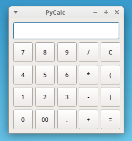
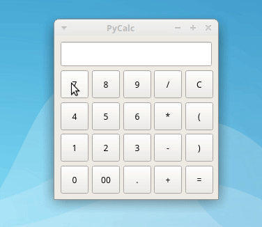

# PyCalculator

PyCalculator is a sample calculator implemented using Python 3 and with a [PyQt6](https://www.riverbankcomputing.com/static/Docs/PyQt6/introduction.html) GUI. PyCalculator runs basic mathematics operations like division, multiplication, addition, and subtraction.

PyCalculator is intended to be a demonstrative example of how to build a Python + PyQt6 GUI application using the Model-View-Controller (MVC) pattern.

## Screenshot



## Requirements

For PyCalculator to work, you need to have [Python](https://www.python.org) 3.6.1 and above. Then you need to install the PyQt6 library. You can do this by using `pip` in a Python virtual environment:

```console (terminal/cmd)
$ python -m venv venv
$ source venv/bin/activate
$ python -m pip install pyqt6
```

After these commands have finished, you can run PyCalculator as shown in the next section below.

## How to Run PyCalculator

To run PyCalculator from your system's command line or terminal, execute the following command:

```console
$ python pycalculator.py
```

After running this command, you'll get PyCalculator running on your machine.

## How to Use PyCalculator

To use PyCalc, just enter a valid math expression using your mouse and then press `Enter` or click the `=` button to get the result:


